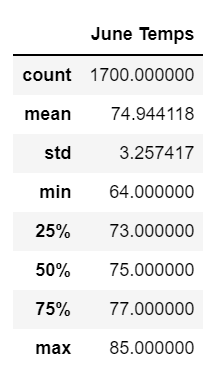
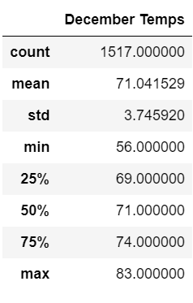

# surfs_up

## Overview of the analysis

W. Avy likes your analysis, but he wants more information about temperature trends before opening the surf shop. Specifically, he wants temperature data for the months of June and December in Oahu, in order to determine if the surf and ice cream shop business is sustainable year-round.

## Results

- The following tables summarize June's temperature statistics over time.

- The following table summarizes Decembers temperature statistics over time.

- These tables tell us about the differing weather patterns for the two monthly periods. For example:
  1. Average temperature between June and December is 75 and 71 degrees respectively. There is a difference of 4 degrees between the months.
  2. The maximum temperatures between June and December is 85 and 83 degrees respectivelyare. June is warmer.
  3. The standard deviation is very similar between both months.

## Summary
The weather in December and June are historically very similar, December is colder than June on average.

Additional queries to perform to gather more weather data for June and December: Include date in queries and order them by date to estimate the temperature of the next month. Include precipation in both cases (June and December).
